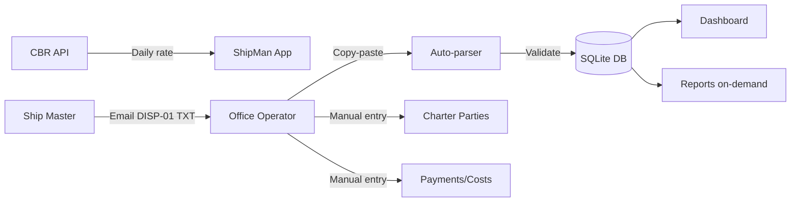

# shipman
solo-developer's project Small Fleet Operations Manager

# Software Requirements Specification (SRS)
## ShipMan – Small Fleet Operations Manager
**Version 2.1** (Final for MVP)

**Document Date:** 2026-05-27  
**Prepared for:** Small Shipping Company (2-3 vessels initial)  
**Development Platform:** Ubuntu + Python/Tkinter/sqlite3/pandas  
**Language:** Bilingual (English / Russian) with runtime toggle

---

## Table of Contents
1. Introduction
2. Overall Description
3. User Roles
4. Functional Requirements
4.1 Vessel Management
4.2 Daily Report Module (DISP-01)
4.3 Charter Party Management
4.4 Voyage Management
4.5 Payment Tracking (Dual Currency)
4.6 Voyage Costs & Port Call Costs
4.7 Bunker Replenishment
4.8 Exchange Rate Automation (CBR API)
4.9 Dashboard
4.10 Reports Module (On-Demand Only)
4.11 Audit Log (Limited Scope)
5. Data Dictionary
6. Non-Functional Requirements
7. User Interface Requirements
8. Constraints & Assumptions
9. Future Enhancements
10. Acceptance Criteria
11. Appendices (Full DISP-01 Code List)

---

## 1. Introduction

### 1.1 Purpose
ShipMan is a desktop application for managing daily fleet operations, charter parties, voyage economics, and payment tracking for a small shipping company (2-3 vessels initially). The application runs locally on Ubuntu with potential future cloud migration.

### 1.2 Scope

**In Scope (MVP):**
- Vessel registration with detailed technical specifications
- Daily report entry via DISP-01 coded format (full field list)
- Manual TXT copy-paste with auto-parsing
- Charter party management (time, voyage, bareboat)
- Voyage management (many voyages per charter party)
- Payment tracking (RUB/USD dual currency with CBR daily rates)
- Voyage cost tracking including port call costs
- Bunker replenishment tracking
- Dashboard with alerts
- Operational reports (on-demand only)
- Bilingual UI (English/Russian)
- Role-based access control
- Audit logging (excluding vessel/config changes)

**Out of Scope (Future):**
- OPEX/CAPEX full module
- Map/GIS integration
- Automatic laytime calculation
- AIS/sensor integration
- Cloud deployment
- Mobile app
- Scheduled automated reports

---

## 2. Overall Description

### 2.1 User Environment
- **Office:** Single Ubuntu PC, one operator + admin
- **Ships:** 2-3 vessels, masters email daily reports in DISP-01 format
- **Network:** Internet required only for daily CBR exchange rate fetch
- **Database:** Local SQLite, backed up daily

### 2.2 Operational Concept

### 2.3 Design Constraints
- Python 3.10+ with Tkinter
- SQLite for database
- HTTP GET to `https://www.cbr.ru/eng/currency_base/daily/` for exchange rates
- Must work offline except for rate fetch

---

## 3. User Roles

| Role | Access Level | Permissions |
|------|--------------|-------------|
| **Master** | Vessel-specific | View/add/edit only own vessel's daily reports. No commercial/financial data. |
| **Operator** | Full system | CRUD all data: vessels, charters, voyages, payments, costs, reports, approve reports. |
| **Finance** (future) | Read-only financial | View payments, costs, generate financial reports. |
| **Admin** | Full + system | User management, database backup, manual rate override, system config. |

---

## 4. Functional Requirements

### 4.1 Vessel Management

**FR-01:** System shall allow operator to register vessels with all fields from previous SRS (name, IMO, year, flag, type, dimensions, deadweight, capacities, engine power, and fuel consumption profiles for IFO/MGO across all operational modes).

**FR-02:** Audit log **shall NOT** record vessel changes or configuration changes.

### 4.2 Daily Report Module (DISP-01 Format)

**FR-03:** System shall accept daily reports via:
- Manual entry form
- TXT/plain text paste with **auto-parsing** of DISP-01 coded format

**FR-04:** DISP-01 Parser shall recognize **all codes** from the company's SMS manual. The complete list is provided in **Appendix A**.

**FR-05:** Date parsing rules:
- **Input format:** `DDMM/HRMN` or `DDMM/HR:MN` (e.g., `2705/0800` or `2705/08:00` = May 27th, 08:00)
- **Output storage:** ISO format `YYYY-MM-DD HH:MM:SS` (e.g., `2026-05-27 08:00:00`)
- **Year inference:** Current year assumed; if date > today, assume previous year

**FR-06:** Critical parsed fields include but are not limited to:

| Code | Field Description | DB Field | Required |
|------|-------------------|----------|----------|
| 1 | Date/time MSK | `report_datetime` | Yes |
| 2 | Latitude/Longitude | `latitude`, `longitude` | Yes |
| 3 | Port name | `port_name` | Conditional |
| 4 | Wind direction/speed (m/s) | `wind_dir`, `wind_speed_ms` | Yes |
| 5 | Sea direction/swell (points) | `sea_dir`, `sea_state_points` | Yes |
| 6 | Course/Speed (knots) | `course`, `avg_speed_knots` | Yes |
| 10 | Distance run (nm) | `distance_run_nm` | Yes |
| 11 | Distance to destination (nm) | `distance_to_dest_nm` | Yes |
| 31 | Bunker IFO/MGO (MT) – ROB | `rob_ifo_mt`, `rob_mgo_mt` | Yes |
| 43 | Port of destination | `next_port_name` | Yes |
| 44 | ETA | `eta_next_port` | Yes |
| 100 | Free text (max 120 chars) | `free_text` | No |

**Complete code list** in Appendix A includes codes for ice, icebreakers, cargo, mooring, pilot, crew changes, tugs, etc.

**FR-07:** Validation rules:
- Report date cannot be in the future
- No duplicate report for same vessel/date
- **Fuel consumption validation (soft warning):**
  - Calculate expected IFO consumption = previous day's ROB_IFO - current day's ROB_IFO
  - If consumption > 0 but no bunker replenishment recorded in last 24h, and consumption exceeds 20% of vessel's normal daily consumption → show warning (not error)
  - Same for MGO
  - Warning is suppressed if bunker replenishment exists for that fuel grade in last 24h

**FR-08:** Operator can approve reports after review. Approved reports cannot be edited without admin override.

### 4.3 Charter Party Management

**FR-09:** System shall store charter parties with all fields from previous SRS, including contract currency (RUB/USD).

**FR-10:** Support up to 3 brokers per charter with individual commission percentages.

**FR-11:** One charter party can have **many voyages** (critical for time charters).

### 4.4 Voyage Management

**FR-12:** System shall allow creating voyages linked to a charter party with:

| Field | Type | Required |
|-------|------|----------|
| Voyage number | Text | Yes |
| Load port | Text | Yes |
| Discharge port | Text | Yes |
| Start date | Date | Yes |
| End date | Date | No |
| Cargo name | Text | Yes |
| Cargo quantity loaded (MT) | Decimal | Yes |
| Is laden | Boolean | Yes |

**FR-13:** Daily reports can be linked to a specific voyage.

### 4.5 Payment Tracking (Dual Currency)

**FR-14:** Currency display rule:
- User selects display currency (RUB or USD) via toggle
- When USD transaction is displayed in RUB mode, convert using **exchange rate valid on the transaction's date** (from exchange_rates table)
- When RUB transaction is displayed in USD mode, convert using same historical rate
- **Original currency amount always shown alongside converted amount**

**FR-15:** All monetary values stored in RUB. USD amounts converted at entry using exchange rate from CBR for that date.

**FR-16:** Payment status workflow: `pending` → `invoiced` → `partial` → `received` → `overdue`

**FR-17:** System auto-calculates expected payments from charter data.

### 4.6 Voyage Costs & Port Call Costs

**FR-18:** In addition to voyage-level costs (d/as, fuel, pilotage, ice-breakers, towage, port charges, canal dues, agency fees), system shall allow **per-port-call costs**:

| Field | Description |
|-------|-------------|
| Port name | Where cost incurred |
| Cost type | Same categories + "other" |
| Amount (original currency) | |
| Currency (RUB/USD) | |
| Invoice date | |
| Paid date | |
| Status | pending/paid |

**FR-19:** Port call costs are linked to voyage + specific port (optional).

**FR-20:** Bunker replenishment in port is handled by FR-21-22 below.

### 4.7 Bunker Replenishment

**FR-21:** System shall record bunker replenishment events:

| Field | Type |
|-------|------|
| Vessel | FK |
| Date/time | Timestamp |
| Port | Text |
| Fuel grade | Enum (IFO, MGO, both) |
| IFO amount (MT) | Decimal (if applicable) |
| MGO amount (MT) | Decimal (if applicable) |
| Cost (original currency) | Decimal |
| Cost currency | RUB/USD |
| Supplier | Text |
| Invoice number | Text |

**FR-22:** When validating daily report fuel consumption (FR-07), system checks for bunker replenishment in the 24 hours prior to the report. If found, consumption exceeding normal range **does not trigger a warning** for the replenished fuel grade.

### 4.8 Exchange Rate Automation (CBR API)

**FR-23:** System shall fetch USD to RUB exchange rate daily from the Central Bank of Russia:
- **URL:** `https://www.cbr.ru/eng/currency_base/daily/`
- **Parsing:** Extract USD row (Char code `840`) – "Rate" column value
- **Schedule:** Every day at application startup (if internet available)
- If fetch fails, use last known rate and notify user

**FR-24:** Rates are stored in `exchange_rates` table with date and rate.

**FR-25:** User can manually override rate for a specific date via admin panel. Manual override is flagged in audit log.

**FR-26:** For display conversion (FR-14), system always uses rate from the **transaction's date** (not today's rate).

### 4.9 Dashboard

**FR-27:** Dashboard shall display:
1. **Vessel Status Table:** vessel, last report date, overdue flag (>30 hours), fuel consumption last 24h (IFO+MGO), distance covered
2. **Payment Alerts:** upcoming (≤7 days, yellow), overdue (red) – shows original amount + currency
3. **Bunker Alerts:** low ROB warnings (below user-defined threshold)
4. **Quick Stats:** voyages this month, cargo carried this month (MT)

### 4.10 Reports Module (On-Demand Only)

**FR-28:** All reports are generated **only on user demand** (no scheduled/automated email reports in MVP).

**FR-29:** Report types:
- Fuel efficiency (actual vs spec, by mode)
- Distance & speed summary
- Commercial summary (total cargo MT, total voyages)
- Financial summary (income, costs, profit) – with currency toggle
- Port call cost breakdown
- Bunker replenishment history

**FR-30:** All reports exportable to Excel (XLSX).

### 4.11 Audit Log (Limited Scope)

**FR-31:** Audit log **shall record** changes to:
- Daily reports (insert, update, delete, approve)
- Charter parties
- Payments
- Voyage costs
- Bunker replenishments
- Exchange rate manual overrides

**FR-32:** Audit log **shall NOT record** changes to:
- Vessels (ship specifications)
- System configuration
- Users (except role changes)

**FR-33:** Audit log stores: user, timestamp, table, record ID, action, old values (JSON), new values (JSON).

---

## 5. Data Dictionary (Key Tables)

| Table | Purpose | Audit Logged? |
|-------|---------|----------------|
| `vessels` | Ship specs | **NO** |
| `charter_parties` | Charter contracts | YES |
| `voyages` | Individual voyages | YES |
| `daily_reports` | DISP-01 messages | YES |
| `bunker_replenishments` | Bunker taken | YES |
| `voyage_costs` | Expenses | YES |
| `port_call_costs` | Per-port expenses | YES |
| `payments` | Income tracking | YES |
| `exchange_rates` | USD/RUB rates | Manual overrides only |
| `users` | Authentication | Role changes only |
| `system_config` | Settings | **NO** |

---

## 6. Non-Functional Requirements

### 6.1 Performance
- Dashboard load < 3 seconds for 3 vessels, 1 year data
- CBR rate fetch < 5 seconds (with timeout 10s)
- Parser < 0.5 seconds per DISP-01 message

### 6.2 Reliability
- Daily database backup at 00:00 (configurable)
- Graceful degradation if CBR fetch fails (use last rate, log error)

### 6.3 Security
- Passwords hashed (bcrypt)
- Role-based access enforced
- No external data transmission except CBR fetch

### 6.4 Usability
- Bilingual UI (EN/RU) with runtime toggle
- Keyboard shortcuts: Ctrl+S (save), Ctrl+F (search)
- Tooltips in both languages
- Input validation with clear error messages in selected language

### 6.5 Platform
- Ubuntu 20.04+ (development and deployment)
- Python 3.10+
- SQLite 3.31+

---

## 7. User Interface Requirements

### 7.1 Currency Display Examples

| Scenario | Display Format |
|----------|----------------|
| RUB transaction, RUB mode | `1,234,567.89 ₽` |
| USD transaction, USD mode | `12,500.00 USD` |
| USD transaction, RUB mode (historical rate 71.6680) | `895,850.00 ₽ (12,500 USD @ 71.6680 on 2026-05-27)` |
| RUB transaction, USD mode (historical rate 71.6680) | `17,234.56 USD (1,234,567.89 ₽ @ 71.6680 on 2026-05-27)` |

### 7.2 Daily Report Entry – Parser Feedback

After pasting DISP-01 text and clicking "Parse":
- Show extracted fields in a preview table
- Highlight missing required fields
- Allow manual correction before saving

### 7.3 Bunker Replenishment Entry

Dedicated form accessible from:
- Daily report entry (quick add)
- Voyage costs section
- Main menu

---

## 8. Constraints & Assumptions

### Assumptions
1. Masters follow DISP-01 format exactly as per SMS manual (Appendix A)
2. CBR website structure remains stable (USD row with char code 840)
3. Internet available at least once daily for rate fetch
4. Single operator concurrency

### Constraints
1. No offline rate fetch fallback except last known rate
2. No automatic email import (manual copy-paste)
3. No map feature in MVP
4. Audit log excludes vessel/config changes per your requirement

---

## 9. Future Enhancements (Post-MVP)

- Scheduled automated reports via email
- OPEX/CAPEX module
- Map view
- Laytime auto-calculation
- Cloud deployment (PostgreSQL)

---

## 10. Acceptance Criteria

- [ ] DISP-01 parser extracts all codes from Appendix A correctly
- [ ] Date parsing handles `DDMM/HRMN` and `DDMM/HR:MN`
- [ ] Fuel consumption warning respects bunker replenishment within 24h
- [ ] CBR rate fetch works and stores USD/RUB correctly
- [ ] Currency display uses historical rate from transaction date
- [ ] Audit log excludes vessel and config changes
- [ ] Port call costs and bunker replenishment can be entered per voyage/port
- [ ] All reports export to Excel
- [ ] Bilingual UI toggles without restart

---

## Appendix A: Complete DISP-01 Code List

| Code | Data Field | Notes |
|------|------------|-------|
| 1 | Date/time MSK | Format: DDMM/HHMM |
| 2 | Latitude/Longitude | e.g., 6457N/04000E |
| 3 | Port name | Current port if in port |
| 4 | Wind direction/speed | m/s |
| 5 | Sea direction/swell | points (0-9) |
| 6 | Course/Speed | knots |
| 7 | Crew/passengers | count |
| 8 | Ice concentration | points (0-10) |
| 9 | Icebreaker operations | start/end datetime |
| 10 | Distance run | nautical miles, 24h |
| 11 | Distance to destination | nautical miles |
| 16 | Pilot embarkation time | datetime MSK |
| 19 | Port arrival | datetime MSK |
| 20 | NOR tendered | datetime MSK |
| 21 | Cargo operations start | datetime MSK |
| 22 | Cargo operations end | datetime MSK |
| 23 | Cargo type | text |
| 24 | Cargo quantity | MT or m³ |
| 25 | Draft fore/aft | meters |
| 26 | Anchoring | datetime MSK |
| 27 | Planned anchor weighing | datetime MSK |
| 30 | Ballast on board | MT |
| 31 | Bunker ROB | IFO/MGO in MT |
| 32 | Lube oil | liters |
| 33 | Bunker received | IFO/MGO MT |
| 34 | Stores received | text |
| 35 | Provisions received | text |
| 36 | Fresh water | MT |
| 37 | Lube oil received | liters |
| 38 | Fresh water received | MT |
| 39 | Crew change | positions, count |
| 40 | Tug operations | count, start/end |
| 41 | Departure | datetime MSK |
| 42 | Pilot disembarkation | datetime MSK, name |
| 43 | Port of destination | text |
| 44 | ETA | day/month/time MSK |
| 45 | Anchoring time | datetime MSK |
| 46 | Weather forecast | wind direction/speed |
| 51 | Storm anchorage | text |
| 52 | ETA to waypoints | Kanin Nos, Zhelaniya, Karskiye Vorota |
| 100 | Free text | max 120 chars, NC! prefix for non-conformity |

**End of message marker:** `NNNN`

---

