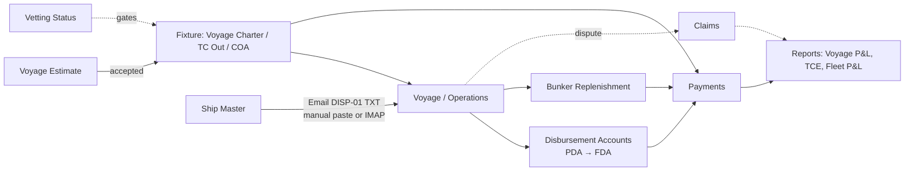

# Software Requirements Specification (SRS)
## ShipMan v2 – Commercial Tanker Operations Manager

**Version 2.1** (Draft for review — incorporates first review pass)

**Document Date:** 2026-08-23
**Prepared for:** Small tanker owner/operator (2–5 clean/product tankers, Arctic–Baltic trade)
**Development Platform:** OS-agnostic local web application — Python backend, browser frontend, SQLite
**Language:** Bilingual (English / Russian) with runtime toggle

This document supersedes [`SRS.md`](SRS.md) (v1, general-cargo/bulk fleet). It is a ground-up rewrite driven by two decisions: (1) the fleet is now clean/product tankers, not general cargo/bulk, which changes vetting, cargo, and Arctic-operations requirements; (2) the previous Tkinter desktop implementation is being replaced with an OS-agnostic architecture. Domain terms used throughout are defined once, precisely, in [`CONTEXT.md`](CONTEXT.md) — this document does not repeat those definitions inline. Background research supporting the structural decisions below is in [`research_commercial_shipmanagement.md`](research_commercial_shipmanagement.md).

---

## Table of Contents

1. Introduction
2. Overall Description
3. User Roles
4. Functional Requirements
   4.1 Vessel Management
   4.2 Voyage Estimate (Pre-Fixture)
   4.3 Fixture Management
   4.4 Voyage Management
   4.5 Daily Report Module (DISP-01)
   4.6 Vetting & Inspection Management
   4.7 Bunker Replenishment
   4.8 Disbursement Accounts (PDA / FDA)
   4.9 Payments & Currency
   4.10 Off-Hire Tracking
   4.11 Claims Management
   4.12 Exchange Rate Automation
   4.13 Dashboard
   4.14 Reports Module
   4.15 Audit Log
5. Data Dictionary
6. Non-Functional Requirements
7. User Interface Requirements
8. Constraints & Assumptions
9. Future Enhancements
10. Implementation Phasing (MVP Roadmap)
11. Acceptance Criteria
12. Appendix A: DISP-01 Code List

---

## 1. Introduction

### 1.1 Purpose

ShipMan v2 is a commercial ship management application for a tanker owner/operator: it supports the full commercial lifecycle from pre-fixture voyage estimation through fixture, operations, post-fixture accounting, and reporting, for a small owned fleet of clean/product tankers trading the Arctic–Baltic range.

Technical ship management (crewing, planned maintenance, drydocking) is explicitly **out of scope** — this remains, as in v1, a commercial-management tool only.

### 1.2 Scope

**In Scope (MVP):**
- Vessel registration with tanker-specific technical and commercial attributes (incl. ice class, vetting status)
- Pre-fixture voyage estimation (new vs. v1 — closes a gap identified against industry-standard practice)
- Fixture management for three fixture types: Voyage Charter, Time Charter Out, COA, with operator-configurable hire payment terms
- Voyage management linked to fixtures, with operator-defined voyage boundaries (single continuous voyage or split per port-to-port passage)
- Daily report entry via DISP-01 coded format — manual entry/paste **and** automatic retrieval from designated IMAP mailboxes (same DISP-01 field set as v1)
- Vetting/inspection history tracking per vessel
- Bunker replenishment tracking with automatic total-cost calculation (price per MT × quantity)
- Disbursement Account tracking: PDA (lump-sum estimate) and FDA (itemized actuals), reconciled against each other
- Payment tracking (RUB/USD dual currency, RUB as reporting/aggregation currency)
- Off-hire tracking for Time Charter Out fixtures, with automatic hire-deduction calculation from entered dates/times
- Claims tracking (cargo, demurrage, off-hire disputes), separate from clean P&L until resolved
- Ice class as a vessel attribute; icebreaker/escort fees as a distinct voyage cost line; NSR/seasonal notes as free text
- Dashboard with alerts
- On-demand reports, including Voyage P&L, TCE, Fleet P&L Summary, DA reconciliation/variance, vetting expiry, claims status
- Bilingual UI (English/Russian)
- Excel export for all reports

**Out of Scope (MVP; see §9 for phasing):**
- Time Charter In (this operator does not charter tonnage in from other owners)
- CII/EEOI compliance reporting (deferred — see §9)
- Structured NSR permit workflow / seasonal routing rules engine (captured as free text for now)
- Multi-user accounts, roles, and authentication (single-user for now — see §3)
- Packaged installer / one-click launch (terminal-launched is acceptable — see §6.5)
- Map/GIS integration
- Automatic laytime calculation from SOF
- Cloud deployment, mobile app
- Parsing DISP-01 data from email attachments (only the email body text is parsed, for both manual paste and IMAP retrieval)

### 1.3 What Changed From v1, and Why

| Change | Reason |
|---|---|
| Fleet: general cargo/bulk → clean/product tankers | Fleet composition changed; cargo, vetting, and charter-party conventions differ materially by vessel type. |
| Architecture: Tkinter desktop → local web app (Python backend + browser frontend) | v1's monolithic Tkinter structure was a stated pain point; a browser frontend against a backend API is OS-agnostic by construction and forces a cleaner separation of concerns. |
| Added: Voyage Estimate module | Every industry-standard commercial system (Veson IMOS, ShipNet) treats pre-fixture estimation as the entry point of the workflow; v1 started recording data only after a fixture was concluded. |
| Added: Vetting & Inspection tracking | Tanker-specific: charterers require current inspection approval before they'll fix a vessel — this can make a vessel commercially unfixable regardless of price, so it belongs in the commercial model. |
| Added: Claims as a distinct entity | v1 had no way to represent a disputed/uncertain amount without corrupting the clean payment timeline. |
| Restructured: `port_call_costs` → Disbursement Accounts (PDA/FDA) | v1 tracked port costs as generic line items; industry practice is a two-stage reconciled document (estimate vs. actual) per port call, which is what agents actually issue. |
| Added: Ice class (vessel attribute) + escort fee (cost line) | Arctic trade generates commercially material costs and constraints that v1's generic fields didn't surface. |
| Reporting currency: **no change — remains RUB**, USD tracked as secondary | An earlier draft of this document proposed flipping the base/reporting currency to USD, reasoning that industry-standard commercial reporting (freight, hire, TCE) is conventionally USD-denominated. On review, the operator confirmed RUB should remain the reporting/aggregation currency, matching v1. That earlier proposal is recorded and reversed in [ADR-0002](docs/adr/0002-usd-as-reporting-currency.md) / [ADR-0003](docs/adr/0003-rub-remains-reporting-currency.md) rather than silently dropped. |
| Daily report ingestion: manual paste only → manual paste **and** automatic IMAP retrieval | Reduces manual transcription; source emails are left unmodified in the mailbox so nothing is lost if ingestion needs to be re-run. |
| Voyage boundaries: implicit one-passage-per-record → operator-defined | A single continuous voyage can span multiple port-to-port passages (e.g. multi-port loading then multi-port discharging, or a whole TC Out employment period), or the operator can split passages into separate records — the system doesn't force one convention. |
| Hire payment terms: assumed fixed advance schedule → operator-configurable per fixture | Real hire terms vary (advance, arrears, N days after invoice date, etc.); hardcoding one basis would have been wrong for some fixtures. |

---

## 2. Overall Description

### 2.1 User Environment

- **Office:** Single operator, any OS (Windows/Mac/Linux) — no longer Ubuntu-only
- **Ships:** 2–5 owned clean/product tankers, masters email daily reports in DISP-01 format (Russian)
- **Network:** Internet required only for the daily exchange-rate fetch and periodic IMAP polling
- **Database:** Local SQLite, backed up daily

### 2.2 Operational Concept

The commercial workflow runs through five stages, consistent with industry-standard practice (see [`research_commercial_shipmanagement.md`](research_commercial_shipmanagement.md) §2):

### 2.3 Design Constraints

- Python backend (recommended: FastAPI) exposing a local HTTP API
- Browser-based frontend (recommended: React) served locally — specific frontend library is a recommendation, not a locked decision; any framework satisfying the API contract is acceptable
- SQLite for the database
- Must work offline except for the daily exchange-rate fetch and periodic IMAP polling for daily report retrieval
- No authentication in MVP (local-only, single user); designed so auth can be added later without a schema rewrite

---

## 3. User Roles

Single-user for MVP: one **Operator** role with full CRUD access to all data (vessels, fixtures, voyages, payments, DAs, bunkers, vetting, claims, reports).

Multi-user roles (Master with vessel-scoped daily-report access, Finance read-only, Admin) are deferred — see §9. The data model should not preclude adding a `users`/role table later, but no role enforcement is built in MVP.

---

## 4. Functional Requirements

### 4.1 Vessel Management

**FR-01:** System shall allow registering vessels with: name, IMO number, flag, year built, vessel type (clean/product tanker), DWT, LOA, beam, draft, cargo tank capacity (cbm), **ice class notation**, engine power, and fuel consumption profiles for IFO/MGO across operational modes (laden, ballast, idle/anchor, **discharging**).

**FR-02:** Vessel changes are **not** audit-logged (matches v1 — specification/config data, not transactional).

### 4.2 Voyage Estimate (Pre-Fixture)

**FR-03:** System shall allow creating a Voyage Estimate for a candidate voyage, independent of any concluded fixture, capturing: candidate vessel (optional — may be estimated before a specific vessel is assigned), load/discharge ports, laycan window, cargo/grade, estimated cargo quantity, estimated freight or hire rate, estimated bunker consumption and cost, estimated port costs (as a lump provisional figure), estimated voyage duration (days), and resulting estimated TCE.

**FR-04:** Estimate status workflow: `draft` → `under negotiation` → `fixed` (promoted to a Fixture) or `declined`.

**FR-05:** When an Estimate is promoted to a Fixture (FR-06), its projected figures are retained and linked, forming the baseline that the eventual Voyage P&L (FR-47, §4.14) is reconciled against.

### 4.3 Fixture Management

**FR-06:** System shall record Fixtures of three types: **Voyage Charter**, **Time Charter Out**, **COA**. Time Charter In is not supported (this operator does not charter tonnage in). Every Fixture, regardless of type, also carries three universal fields: **date concluded** (the date the deal was struck), **charter party reference** (the deal's ref/C-P number, up to 15 characters), and **charter party type** (the proforma document used, e.g. ASBATANKVOY, SHELLVOY6, GENCON — free text). All three are optional to accommodate historical fixtures where this detail wasn't recorded.

**FR-07:** Voyage Charter fixture fields: charterer, freight rate (per tonne or lump sum), laycan, load/discharge ports, cargo/grade, demurrage rate, despatch rate, laytime terms, contract currency.

**FR-08:** Time Charter Out fixture fields: charterer, hire rate (daily/monthly), charter period (from/to or min-max duration), delivery/redelivery ports and conditions, delivery ROB and redelivery ROB (remaining bunkers on board, IFO and MGO in MT, each optional), contract currency, and **hire payment terms** — operator-defined at fixture creation, not assumed by the system. Payment terms capture the billing basis (e.g. in advance, in arrears, or a fixed number of days after invoice date) and billing frequency (e.g. every 15 or 30 days); the system does not hardcode a single payment convention. Charter period from/to are delivery and redelivery **timestamps**, not bare dates — hire runs from the exact time of delivery to the exact time of redelivery, so the final hire installment is routinely a partial day and must be prorated to the hour, not rounded to a whole day (see FR-34). A bare date is still accepted (assumed midnight) for fixtures that genuinely don't need that precision.

**FR-09:** COA fixture fields: charterer, contract period, cargo/grade, total contracted quantity or number of lifts, rate per tonne (may vary by period/escalation clause), minimum/maximum cargo quantity per lift.

**FR-10:** One Fixture can have many Voyages (each lift under a COA, or each employment period under a TC Out, is tracked as a Voyage — see §4.4).

**FR-11:** Support up to 3 brokers per fixture with individual commission percentages (carried over from v1).

### 4.4 Voyage Management

**FR-12:** System shall allow creating Voyages linked to a Fixture, with: voyage number, vessel, load port, discharge port, start date, end date, cargo/grade, cargo quantity loaded (MT), laden/ballast flag, and free-text ice/NSR routing notes.

**FR-13:** Daily reports (§4.5) can be linked to a specific voyage.

**FR-14:** Voyage boundaries are an **operator decision, not a system-enforced rule**: a single continuous Voyage record may span multiple port-to-port passages (e.g. multi-port loading followed by multi-port discharging, or an entire Time Charter Out employment period under charterer's orders), or the operator may split successive passages into separate Voyage records — whichever matches how they want to track and report on that fixture's activity. The system supports both without requiring the choice to be fixed in advance or applied consistently across all fixtures.

### 4.5 Daily Report Module (DISP-01 Format)

The DISP-01 field set and parsing logic are unchanged from v1 — they already cover what's needed for this fleet. The ingestion mechanism is extended with an automatic IMAP channel alongside manual entry. Full code list in Appendix A.

**FR-15:** System shall accept daily reports via manual entry form or TXT/plain-text paste with auto-parsing of DISP-01 coded format.

**FR-16:** In addition to manual entry/paste (FR-15), system shall support **automatic retrieval of daily reports from one or more operator-designated IMAP mailboxes** (configurable folder, configurable polling interval). Retrieved messages are left intact in the source mailbox — never deleted or moved — and the system tracks already-ingested messages (e.g. by message ID) to avoid duplicate imports. Only the email body text is parsed (see §1.2 — attachments are out of scope for MVP). Automatically retrieved text is passed through the same DISP-01 parser and validation/preview flow as manually pasted text (§7.3). A single poll targets one vessel (the operator selects it per poll call); bulk multi-year historical backfill is done by organizing the mailbox into one folder per vessel per year and polling each in turn, pointing the folder setting at each before polling.

System shall maintain a **folder↔vessel registry**: the vessel a folder is polled under on its first poll is remembered, and a later poll of that same folder under a *different* vessel is rejected (409, naming the previously-associated vessel) unless the operator explicitly confirms the change. This is a hard-learned safeguard, not a hypothetical one — see [ADR-0005](docs/adr/0005-folder-vessel-registry-safeguard.md) for the incident that motivated it and why a content-based cross-check was rejected in favor of this structural fix. The operator can also look up a folder's registered vessel before polling.

**FR-17:** DISP-01 parser shall recognize all codes from the company's SMS manual (Appendix A).

**FR-18:** Date parsing recognizes two shapes for code 1, stored as ISO `YYYY-MM-DD HH:MM:SS`:
- **Native `DDMM/HRMN` or `DDMM/HR:MN`** (no year encoded): the year is inferred relative to a *reference date* — normally the current date, unless the resulting date would be in the future, in which case the previous year is assumed. This 2-year heuristic is only safe when the reference date is close to the report's actual date. For IMAP-retrieved messages, the reference date is the source email's own envelope date (its `Date:` header), not the server's current date — this lets an archived, years-old message resolve to its real year rather than being reinterpreted relative to today (see [ADR-0004](docs/adr/0004-year-resolution-for-multi-year-history.md)).
- **Explicit `YYYY-MM-DD/HRMN` or `YYYY-MM-DD/HR:MN`**: the year is taken as stated, with no inference at all. This is the format an operator amends a historical report's date line to before pasting it manually, whenever the year can't be reliably inferred any other way (bulk multi-year backfill via manual entry, per FR-15).

**FR-19:** Validation: report date cannot be in the future; no duplicate report for the same vessel/date; fuel-consumption soft warning if consumption exceeds 20% of the vessel's normal daily rate with no matching bunker replenishment in the prior 24 hours (suppressed if a replenishment for that fuel grade exists in that window).

**FR-20:** Operator can approve reports after review, regardless of ingestion channel; approved reports cannot be edited without override.

### 4.6 Vetting & Inspection Management

**FR-21:** System shall record, per vessel, a full inspection history: inspection date, inspecting body/charterer, inspection type, expiry date, status (`approved` / `pending` / `expired` / `failed`), and free-text observations/findings.

**FR-22:** Current vetting status per vessel shall be visible from the vessel record and surfaced on the dashboard (FR-42) and as a report (FR-52).

**FR-23:** Vetting status does not block fixture creation in the data model (no hard constraint), but an expired/failed status shall be visibly flagged wherever a vessel is selected for a new Fixture or Voyage Estimate, since it can make the vessel commercially unfixable.

### 4.7 Bunker Replenishment

**FR-24:** System shall record bunker replenishment events: vessel, date/time, port, fuel grade (IFO/MGO/other), quantity supplied (MT), price per metric ton, supplier, invoice number. **Total cost is calculated automatically** as price per MT × quantity supplied, in the original currency; a single replenishment event may cover multiple fuel grades, each priced and totaled independently.

**FR-25:** Bunker replenishment in the 24 hours prior to a daily report suppresses the fuel-consumption warning (FR-19) for the matching grade.

### 4.8 Disbursement Accounts (PDA / FDA)

**FR-26:** System shall record a Disbursement Account per port call, linked to a Voyage and a port, with two stages:
- **PDA**: a single lump-sum estimated amount, currency, and date (the agent's funding estimate — not itemized).
- **FDA**: itemized cost lines (pilotage, towage, mooring, agency fee, husbandry, customs/quarantine, security, other), each with description, amount, and currency.

**FR-27:** System shall compute and display the **FDA total** (sum of line items) and the **variance** (FDA total − PDA amount) once an FDA is entered.

**FR-28:** DA status workflow: `pda_only` → `fda_pending` → `reconciled` (FDA entered and reviewed) → `disputed` (if a line item is contested — links to Claims, §4.11).

**FR-29:** A DA is linked to exactly one Voyage and optionally one specific port call within that voyage.

### 4.9 Payments & Currency

**FR-30:** All monetary values are stored with their original currency and amount, plus a **RUB-equivalent** computed at entry using the historical exchange rate for that transaction's date (from the `exchange_rates` table, §4.12). **RUB is the reporting/aggregation currency; USD remains fully tracked as the secondary currency** for display and for USD-denominated transactions (e.g. freight typically invoiced in USD).

**FR-31:** Currency display rule: user selects display currency (RUB or USD) via toggle; the non-native amount is always shown converted using the **historical rate on the transaction's date**, alongside the original amount and currency (matches v1's FR-14).

**FR-32:** Payment status workflow: `draft` → `pending` → `invoiced` → `partial` → `paid` → `overdue` (carried over from v1, with `draft` added as the initial state per the payments module's existing implementation).

**FR-33:** Payments link to: vessel (required), voyage (optional), fixture (optional), vendor (for expenses, optional), cost type, DA (optional, for reconciled port-cost payments).

**FR-34:** For Time Charter Out fixtures, the system shall generate hire payment installments **according to the fixture's configured payment terms (FR-08)** — supporting advance billing, arrears billing, and fixed-days-after-invoice-date terms — rather than assuming a single fixed billing basis. Triggered from the Fixtures page (vessel selection required); for fixed-days-after-invoice-date terms, the operator may optionally anchor the schedule to the real first invoice date rather than accepting the period-start default — the whole installment schedule shifts by that offset (this shift is date-only; a Payment's invoice/due dates never carry a time of day). Each installment boundary is computed from the delivery timestamp forward (preserving its time of day), so the final installment is prorated to the exact hour of redelivery rather than rounded to a whole day. Generated installments are ordinary Payment records (FR-33) and remain editable afterward on the Payments page like any other payment.

### 4.10 Off-Hire Tracking

**FR-35:** For Time Charter Out fixtures, system shall record off-hire periods: voyage/fixture, start datetime, end datetime, reason. The **off-hire duration and resulting hire deduction are calculated automatically** from the entered start/end datetime and the fixture's hire rate (pro-rated by duration); the operator may override the calculated deduction where charter party terms warrant (e.g. partial off-hire clauses). Off-hire periods reduce the effective hire due for the affected installment (FR-34) and are excluded from the earning-days denominator in TCE calculation (FR-48).

### 4.11 Claims Management

**FR-36:** System shall record Claims of type: cargo quantity, cargo quality, demurrage dispute, off-hire dispute, other — linked to a Voyage and/or Fixture, with counterparty, amount claimed, amount settled (if resolved), currency, status (`open` / `negotiating` / `settled` / `rejected`), date raised, date resolved, and free-text notes.

**FR-37:** Claimed/disputed amounts are **excluded** from Voyage P&L (FR-47) and Payment totals while `open` or `negotiating` — they surface only in the dedicated Claims report (FR-53) until settled, at which point the settled amount can be linked to an actual Payment record.

**FR-38:** A DA marked `disputed` (FR-28) can be linked to a Claim.

### 4.12 Exchange Rate Automation

**FR-39:** System shall fetch the USD/RUB exchange rate daily (source: Central Bank of Russia public rate feed, matching v1's mechanism) at application startup if internet is available; on failure, use the last known rate and notify the user.

**FR-40:** Rates are stored in the `exchange_rates` table by date. All historical currency conversions (FR-30, FR-31) use the rate for the transaction's own date, never today's rate.

**FR-41:** User can manually override a rate for a specific date; overrides are flagged in the audit log.

### 4.13 Dashboard

**FR-42:** Dashboard shall display: vessel status table (last report date, overdue flag, 24h fuel consumption, distance covered); payment alerts (upcoming ≤7 days, overdue); bunker low-ROB alerts; **vetting expiry alerts** (new — vessels within a configurable window of vetting expiry); quick stats (voyages this month, cargo carried this month).

### 4.14 Reports Module

All reports generated on-demand, exportable to Excel — matches v1's approach.

**FR-43:** Voyage Summary Report — voyage number, vessel, ports, dates, distance, fuel consumed, average speed, link to daily reports.

**FR-44:** Fleet Distance & Speed Analysis — by vessel, by period.

**FR-45:** Fuel Consumption Report — by vessel and period, IFO/MGO.

**FR-46:** Laden vs. Ballast Performance — speed/consumption comparison.

**FR-47:** Voyage P&L Report — revenue (freight/hire, demurrage) minus voyage costs (bunkers, DA totals, canal dues, agency/broker commissions), reconciled against the originating Voyage Estimate (FR-05) where one exists.

**FR-48:** TCE Report — per voyage and fleet-average, per the standard formula `(Voyage Revenue − Voyage Expenses) / Voyage Duration in Days` (see [`CONTEXT.md`](CONTEXT.md)), excluding off-hire days per FR-35.

**FR-49:** Fleet P&L Summary — aggregated revenue/costs/net profit across the fleet for a selected period.

**FR-50:** Payment Status Report — all invoices with due dates and status.

**FR-51:** DA Reconciliation Report — PDA vs. FDA totals and variance per port call/voyage, flagging unreconciled or disputed DAs.

**FR-52:** Vetting Status Report — current status and next expiry per vessel.

**FR-53:** Claims Status Report — open/negotiating claims with amounts and age.

**FR-54:** All reports exportable to Excel (XLSX), carried over from v1.

### 4.15 Audit Log

**FR-55:** Audit log shall record changes to: daily reports, fixtures, voyages, voyage estimates, payments, disbursement accounts, bunker replenishments, vetting records, claims, exchange rate manual overrides.

**FR-56:** Audit log shall **not** record changes to vessels (specifications) or system configuration.

**FR-57:** Audit log stores: user, timestamp, table, record ID, action, old values (JSON), new values (JSON).

---

## 5. Data Dictionary (Key Tables)

| Table | Purpose | Audit Logged? | Status vs. v1 |
|---|---|---|---|
| `vessels` | Ship specs incl. ice class | NO | Extended (ice class, vetting FK, discharging fuel mode) |
| `voyage_estimates` | Pre-fixture projections | YES | **New** |
| `fixtures` | Voyage Charter / TC Out / COA (replaces `charter_parties`) | YES | Renamed + `fixture_type` and configurable hire payment terms added |
| `voyages` | Individual voyages/employment periods | YES | Unchanged fields; boundary is now an explicit operator choice (FR-14) |
| `daily_reports` | DISP-01 messages | YES | Extended (adds IMAP as an ingestion source alongside manual paste) |
| `vetting_inspections` | Inspection history per vessel | YES | **New** |
| `bunker_replenishments` | Bunker taken | YES | Extended (price-per-MT × quantity → automatic total cost) |
| `disbursement_accounts` | PDA per port call | YES | Restructures `port_call_costs` |
| `disbursement_account_lines` | FDA itemized lines | YES | **New** |
| `payments` | Income/expense tracking | YES | Unchanged (RUB base, USD tracked secondary — a mid-draft proposal to flip this was reconsidered and reverted; see [ADR-0003](docs/adr/0003-rub-remains-reporting-currency.md)) |
| `off_hire_periods` | TC Out off-hire tracking | YES | **New** — hire deduction auto-calculated from dates, operator-overridable |
| `claims` | Cargo/demurrage/off-hire disputes | YES | **New** |
| `exchange_rates` | USD/RUB rates | Manual overrides only | Unchanged mechanism |
| `cost_types`, `vendors` | Lookup tables | N/A | Carried over from v1 Phase 1 |

---

## 6. Non-Functional Requirements

### 6.1 Performance

- Dashboard load < 3 seconds for 5 vessels, 1 year of data
- Exchange rate fetch < 5 seconds (timeout 10s)
- DISP-01 parser < 0.5 seconds per message, regardless of ingestion channel

### 6.2 Reliability

- Daily database backup (configurable time)
- Graceful degradation if exchange-rate fetch fails (use last known rate, log error)
- Graceful degradation if IMAP polling fails (retry on next interval; no data loss since source emails are never deleted)

### 6.3 Security

- No authentication in MVP (single-user, local-only) — see §3, §9
- No external data transmission except the exchange-rate fetch and IMAP retrieval (read-only mailbox access)

### 6.4 Usability

- Bilingual UI (EN/RU) with runtime toggle, no restart required
- Input validation with clear error messages in the selected language

### 6.5 Platform

- OS-agnostic: Windows, macOS, Linux
- Python backend (FastAPI recommended), SQLite 3.31+, browser-based frontend (React recommended — not a locked choice, see §2.3)
- Launched via terminal/start script; no packaged installer required for MVP

---

## 7. User Interface Requirements

### 7.1 Currency Display Examples

| Scenario | Display Format |
|---|---|
| RUB transaction, RUB mode | `1,234,567.89 ₽` |
| USD transaction, USD mode | `12,500.00 USD` |
| USD transaction, RUB mode (historical rate 71.6680) | `895,850.00 ₽ (12,500 USD @ 71.6680 on 2026-08-23)` |
| RUB transaction, USD mode (historical rate 71.6680) | `17,234.56 USD (1,234,567.89 ₽ @ 71.6680 on 2026-08-23)` |

### 7.2 Disbursement Account Entry

- PDA entry: single amount + currency + date field, linked to a port call.
- FDA entry: itemized line-item table (type, description, amount, currency); running FDA total and variance-vs-PDA shown live as lines are added.

### 7.3 Daily Report Entry — Parser Feedback

Whether a report arrives via manual paste or automatic IMAP retrieval (FR-16), the flow after parsing is the same: show extracted fields in a preview table, highlight missing required fields, allow manual correction before saving. Auto-retrieved reports awaiting review appear in an inbox-style queue rather than being saved directly, so the operator reviews each one before it's committed — matching the existing approval step (FR-20).

### 7.4 Voyage Estimate → Fixture Promotion

When promoting an accepted Estimate to a Fixture, pre-fill the Fixture form from the Estimate's fields; the Estimate remains linked (read-only) for later P&L reconciliation.

---

## 8. Constraints & Assumptions

### Assumptions

1. Masters follow DISP-01 format exactly as per the SMS manual (Appendix A)
2. Exchange-rate source structure remains stable
3. Internet available at least periodically for the exchange-rate fetch and IMAP polling; a temporary outage doesn't lose data since source emails remain in the mailbox until successfully ingested
4. Single-user concurrency (no simultaneous multi-user writes)
5. IMAP mailbox credentials and folder structure are configured and maintained by the operator; the system does not manage mailbox provisioning

### Constraints

1. No offline rate-fetch fallback except last known rate
2. IMAP retrieval only parses the email body text, not attachments (same parser, same format expectations as manual paste)
3. No structured NSR permit / seasonal-restriction workflow in MVP — free text only
4. No authentication in MVP

---

## 9. Future Enhancements (Post-MVP)

- Time Charter In support (if the operator ever charters tonnage in)
- CII / EEOI compliance reporting, using data already captured (distance, consumption, DWT)
- Structured NSR permit and seasonal-routing-restriction tracking
- Multi-user roles and authentication (Master vessel-scoped access, Finance read-only, Admin)
- Packaged one-click installer
- PostgreSQL migration path if multi-user concurrency is needed
- Scheduled/automated report delivery
- Map/GIS integration, AIS integration
- Automatic laytime calculation from Statement of Facts
- Parsing DISP-01 data from email attachments, not just body text

---

## 10. Implementation Phasing (MVP Roadmap)

**Phase 1 — Foundation:** Vessel Management, Fixture Management (all 3 types, incl. configurable hire payment terms), Voyage Management (incl. operator-defined voyage boundaries), Daily Report Module (DISP-01 manual entry + IMAP auto-retrieval), Exchange Rate Automation.

**Phase 2 — Financial Core:** Payments & Currency, Bunker Replenishment (incl. automatic cost calculation), Disbursement Accounts (PDA/FDA), Voyage P&L and TCE reports.

**Phase 3 — Commercial Depth:** Voyage Estimate module, Vetting & Inspection Management, Off-Hire Tracking (incl. automatic calculation), Claims Management.

**Phase 4 — Reporting & Polish:** Remaining reports (Fleet P&L Summary, DA Reconciliation, Vetting Status, Claims Status), Dashboard, Audit Log, Excel export across all reports.

*(Deferred entirely: CII/EEOI, multi-user/auth, structured NSR tracking — see §9.)*

---

## 11. Acceptance Criteria

- [ ] Voyage Estimate can be created, edited, and promoted to a Fixture with figures carried over
- [ ] All three fixture types (Voyage Charter, TC Out, COA) can be created with their respective fields, including operator-defined hire payment terms for TC Out
- [ ] DISP-01 parser extracts all codes from Appendix A correctly (unchanged from v1)
- [ ] Daily reports can be retrieved automatically from a configured IMAP mailbox without altering or removing the source emails, and go through the same parser/preview/approval flow as manual paste
- [ ] Operator can record a multi-port itinerary as one continuous voyage or split it into separate per-passage voyages, per fixture
- [ ] Fuel consumption warning respects bunker replenishment within 24h
- [ ] Vetting status is visible on vessel record, dashboard, and report; expired status is visibly flagged at fixture/estimate creation
- [ ] PDA (lump-sum) and FDA (itemized) can be entered per port call, with variance computed automatically
- [ ] Bunker replenishment total cost is calculated automatically from price per MT × quantity, per fuel grade
- [ ] Exchange rate fetch works and stores USD/RUB correctly; currency display uses the historical rate from the transaction's date, with RUB as the reporting/aggregation currency
- [ ] Hire payment installments follow the fixture's configured payment terms, not a hardcoded schedule
- [ ] Off-hire hire deduction is calculated automatically from entered start/end datetime, with an operator override available
- [ ] Claims can be recorded and are excluded from Voyage P&L while open/negotiating
- [ ] Audit log excludes vessel and config changes; includes all other listed tables
- [ ] All reports export to Excel
- [ ] Bilingual UI toggles without restart
- [ ] Application runs identically (same code, no platform-specific branches) on Windows, macOS, and Linux

---

## Appendix A: DISP-01 Code List

Unchanged from v1 — carried over verbatim since the field set already covers what's needed for this fleet (confirmed during requirements review), regardless of whether a report arrives by manual paste or IMAP retrieval. See [`SRS.md` Appendix A](SRS.md) for the complete code table (codes 1–100, ice/icebreaker/cargo/mooring/pilot/crew-change/tug codes, end-of-message marker `NNNN`).
